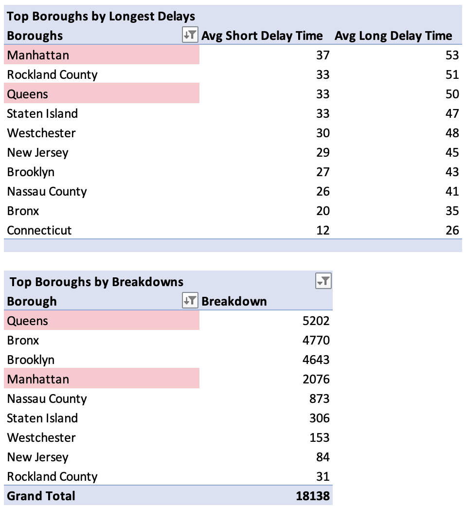

# Improving NYC Bus Reliability: Analyzing Delays and Breakdowns

# Table of Contents
- [**Project Background**](#project-background)
- [**Data Structure & Initial Checks**](#data-structure--initial-checks)
- [**Executive Summary**](#executive-summary)
- [**Insights Deep Dive**](#insights-deep-dive)
  - [**What Are the Leading Causes of Bus Breakdowns and Delays?**](#what-are-the-leading-causes-of-bus-breakdowns-and-delays)
  - [**Where Are Bus Delays the Most Severe?**](#where-are-bus-delays-the-most-severe)
  - [**Which Companies and Boroughs Contribute the Most to Service Disruptions?**](#which-companies-and-boroughs-contribute-the-most-to-service-disruptions)
  - [**When Are Breakdowns and Delays Most Frequent?**](#when-are-breakdowns-and-delays-most-frequent)
- [**Recommendations**](#recommendations)
- [**Assumptions and Caveats**](#assumptions-and-caveats)

---

# Project Background
Frequent bus breakdowns and delays continue to disrupt daily commutes in New York City, creating challenges for transit operations and passenger experience. In this case study, I take on the role of a data analyst for the New York Division of Transportation, investigating inefficiencies in scheduling, maintenance, and transit reliability to help fleet managers and transit teams improve service performance. This analysis is based on data sourced from the City of New York's Open Data platform.

The Excel workbook, which includes data cleaning and exploratory analysis, is available for review [here.](https://drive.google.com/file/d/1dMir4RXcHYUZkAWSv4vVEhzBwoXcVDk3/view?usp=sharing)

Raw dataset available for download [here.](Exploration/NYC_Bus_Breakdowns_Delays_Raw_Dataset.xlsb)

---

# Data Structure & Initial Checks
The dataset consists of a single table with 282,190 records of bus breakdowns and delays from 2019 to 2023. The data is categorized into the following key areas:
- **Incident Details** – Type of incident, reason, borough, and bus company.
- **Operational Data** – Schools affected, route number, student impact, and school year.
- **Response Tracking** – Date and time of incidents, duration of delays, and whether schools or parents were notified.

## Data Cleaning Steps
To ensure data integrity, the following cleaning steps were taken:
- Used the `TEXT()` function to extract the day of the week from `Occurred_On` to identify weekday trends in breakdowns and delays.
- Extracted the year from `Occurred_On` using the `YEAR()` function.
- Split `How_Long_Delayed` into `Short_Delay_Time_Estimated` and `Long_Delay_Time_Estimated` using the `TEXT-TO-COLUMNS` feature based on predefined thresholds.
- Standardized bus company names by identifying variations and manually correcting inconsistencies.

---

# Executive Summary
Mechanical failures (57%) and traffic congestion (66.8%) are the two biggest drivers of bus breakdowns and delays in NYC. Three bus companies, Pride Transportation, Little Richie Bus Service, and Logan Bus, account for a significant share of disruptions, with Pride alone responsible for over 40% of breakdowns among the top five operators. Queens has seen a 61% increase in breakdowns, signaling potential fleet maintenance issues, while Manhattan experiences the longest average delays (53 minutes), largely due to congestion. Focusing on preventative maintenance, auditing high-risk operators, and dedicated bus lanes in problem areas can help reduce service disruptions and improve transit efficiency.

---

# Insights Deep Dive
## What Are the Leading Causes of Bus Breakdowns and Delays?
### Top Causes of Bus Breakdowns
- Mechanical issues are the leading cause of bus breakdowns, with 10,399 incidents related to "Mechanical Problem" and another 2,970 incidents due to "Won’t Start." Flat Tire accounts for 2,499 cases, making it the third most common issue.
- Together, these three reasons contribute to nearly 87% of all recorded breakdowns, highlighting maintenance as a key factor in fleet reliability.

  

### Top Causes of Delays
- Heavy traffic is the overwhelming cause of bus delays, accounting for 176,196 incidents (66.8%). The "Other" category is the second most common reason, with 49,135 cases (18.6%), suggesting that many delays do not fit neatly into predefined categories.
- Mechanical issues cause both delays (5.2%) and breakdowns, reinforcing the need for better fleet maintenance.

  
  
---

## Where Are Bus Delays the Most Severe?
### Delays by Bus Company
- Selby Transportation has the longest delays, with short delays averaging 60 minutes and long delays reaching 88 minutes.
- Little Linda Bus Co. and Pride Transportation also experience extended delays, with long wait times exceeding 70 minutes.
- The remaining companies in the top 10 report long delays between 60 and 67 minutes, indicating ongoing operational challenges.

   

### Delays by Borough
- Manhattan experiences the longest delays, with short delays averaging 37 minutes and long delays reaching 53 minutes.
- Rockland County and Queens also experience long delays exceeding 50 minutes, suggesting a trend in urban congestion.
- Connecticut reports the shortest delays, with long delays averaging only 26 minutes

  

---

## Which Companies and Boroughs Contribute the Most to Service Disruptions?
### Bus Companies with Frequent Breakdowns and Long Delays
- Several bus companies rank in the top 10 for both delays and breakdowns, including Pride Transportation, Little Richie Bus Service, Logan Bus Company, and Lorinda Enterprises. Among them, Pride, Little Richie, and Logan also rank in the top five for total breakdowns, making them key contributors to service disruptions.
  
  
  
- To better understand these trends, I analyzed the top five breakdown companies, comparing those that also rank in the top 10 for delays with the other top breakdown contributors. 
  - Pride Transportation experienced extreme volatility: breakdowns dropped 32.7% in 2020, then surged 156% in 2021, followed by 68.5% in 2022 and 36.8% in 2023. By 2023, Pride accounted for over 40% of all breakdowns among the top five companies.
  - Little Richie Bus Service showed a similar trend: breakdowns fell 50.1% in 2021, only to surge 83.6% in 2023.
  - Logan Bus Company followed a comparable pattern, with breakdowns declining 37.8% in 2021 before rising 78.6% in 2022 and 68.5% in 2023.
- These patterns suggest that pandemic-related service cuts may have temporarily masked deeper fleet reliability issues, which have since resurfaced.
- In contrast, Hoyt and Quality Transportation, despite experiencing spikes in 2021 and 2022, show signs of stabilization. Neither company ranks in the top 10 for delays, indicating a lower impact on overall service reliability.

  

  

  

### Boroughs with Frequent Breakdowns and Long Delays
- Queens and Manhattan rank among the top boroughs for both delays and breakdowns, with Queens reporting the highest number of breakdowns overall and the third-highest delay times.
- Manhattan ranks fourth for breakdowns but has the longest average delay times at 53 minutes.

  

- Looking at the year-over-year changes in breakdowns, Queens saw a 60.9% increase in breakdowns in 2023, making it the highest-ranking borough for breakdowns. Despite a 30.4% decline in 2020, breakdowns have steadily risen since, suggesting fleet maintenance issues or operational inefficiencies may be driving both breakdowns and delays.
- In contrast, Manhattan has experienced more gradual changes, with a 5.8% increase in 2023. Its average change of 16.6% over the years indicates a stable trend, and with fewer breakdowns, traffic congestion and route inefficiencies are likely driving delays rather than mechanical failures.

  

  

  

---

## When Are Breakdowns and Delays Most Frequent?
### Breakdown Trends by Day
- Bus breakdowns are most frequent on Monday (4,146 incidents) and steadily decline throughout the week, reaching 3,318 incidents on Friday. 
- Since school buses remain inactive over the weekend, these issues may be due to factors such as cold starts, battery drainage, or unresolved mechanical problems from Friday, possibly leading to higher failure rates at the start of the week.

  

### Delay Trends by Day
- Delays follow a similar pattern, with Monday experiencing the highest number of delays (54,667 incidents). While the cause is not explicitly recorded in the dataset, potential explanations include fleet conditions after a two-day break or heavier traffic congestion at the start of the week.
- A mid-week increase on Wednesday and Thursday suggests possible traffic congestion patterns or operational inefficiencies affecting service reliability.
- By Friday, delays drop sharply (49,512 incidents), possibly due to lighter traffic, fewer after-school programs, or early school dismissals reducing demand.

  

---

# Recommendations
Based on the insights and findings above, I would recommend the following:
### Enhancing Preventative Maintenance to Reduce Breakdowns
- Since 87% of breakdowns result from mechanical issues, focusing on strengthening preventative maintenance could make a significant difference. If we manage to reduce mechanical issues by just 20%, we could avoid thousands of hours of delay, ensuring better service for passengers and fewer disruptions to the schedule.
### Addressing Performance Issues Among High-Risk Bus Companies
- Pride Transportation and other high-risk companies should undergo regular audits to track their performance. By aiming for a 15% reduction in breakdowns over six months, these companies can improve their overall reliability and ensure they’re meeting service expectations.
### Improving Service Reliability in High-Risk Boroughs
- Investigate fleet maintenance and staffing challenges in Queens, which saw a 61% increase in breakdowns in 2023. Deploying a dedicated maintenance team could reduce breakdowns by 20% over the next year, leading to smoother operations and less disruption for riders.
- Use real-time traffic data to adjust schedules and add buses during peak hours in Manhattan, which has the longest average delay time (53 minutes).
### Managing Traffic and Optimizing Routes to Reduce Delays
- Consider exploring dedicated bus lanes in Manhattan, Rockland County, and Queens to reduce delays.
- Refine delay categorization to better understand the nearly 19% of cases classified as "Other" delays, which may reveal additional areas for improvement.
### Reducing Breakdown and Delay Trends Throughout the Week
- Implement weekend fleet inspections to catch maintenance issues before buses return to service on Monday.
- Adjust Monday schedules by deploying extra buses or tweaking departure times on high-delay routes. 
- Look into mid-week congestion patterns (Wednesday and Thursday) to see if route changes or better timing could help reduce delays.

---

# Assumptions and Caveats
- Throughout the analysis, multiple assumptions were made to manage challenges with the data. These assumptions and caveats are noted below:
- This analysis is based on the available dataset of 282,190 records. Factors such as real-time traffic conditions and maintenance logs were not included.
- Since company names were manually reviewed and adjusted for consistency, minor discrepancies may remain due to data entry variations.
- The division of short and long delay times was based on a set threshold for analysis purposes. While this helps categorize delays, actual transit experiences may vary.
- The borough-level analysis assumes that delays and breakdowns are primarily influenced by local conditions such as traffic congestion, fleet maintenance, and infrastructure. Broader citywide issues, such as extreme weather or transit strikes, were not accounted for separately.
- While data patterns indicate possible links between breakdowns, congestion, and delays, additional validation is needed to establish causation.
- The decrease in breakdowns in 2020 and 2021 is likely due to lower bus usage during the pandemic. This assumption is based on industry trends but was not validated with ridership data.

---

- The Excel workbook, which includes data cleaning and exploratory analysis, is available for review [here.](https://drive.google.com/file/d/1dMir4RXcHYUZkAWSv4vVEhzBwoXcVDk3/view?usp=sharing)
- Raw dataset available for download [here.](Exploration/NYC_Bus_Breakdowns_Delays_Raw_Dataset.xlsb)
- For more of my projects and data journey, visit my portfolio website and reach out!
